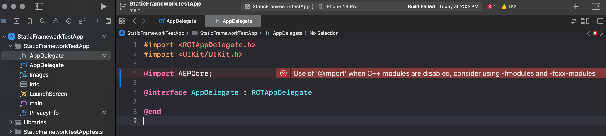
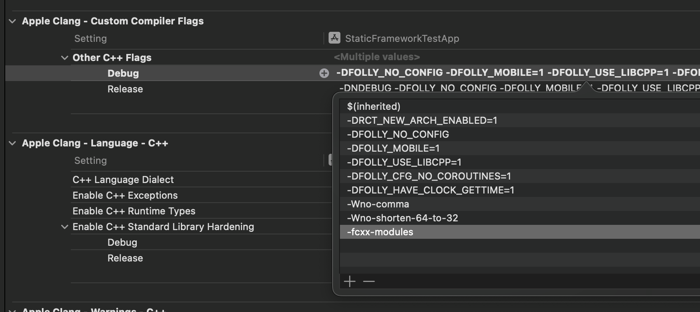
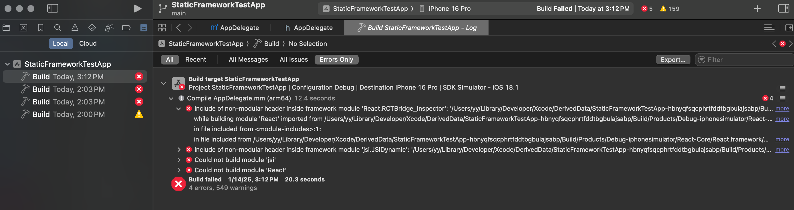
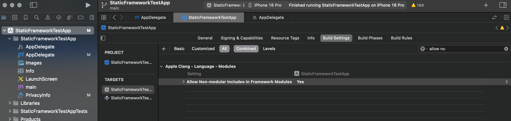
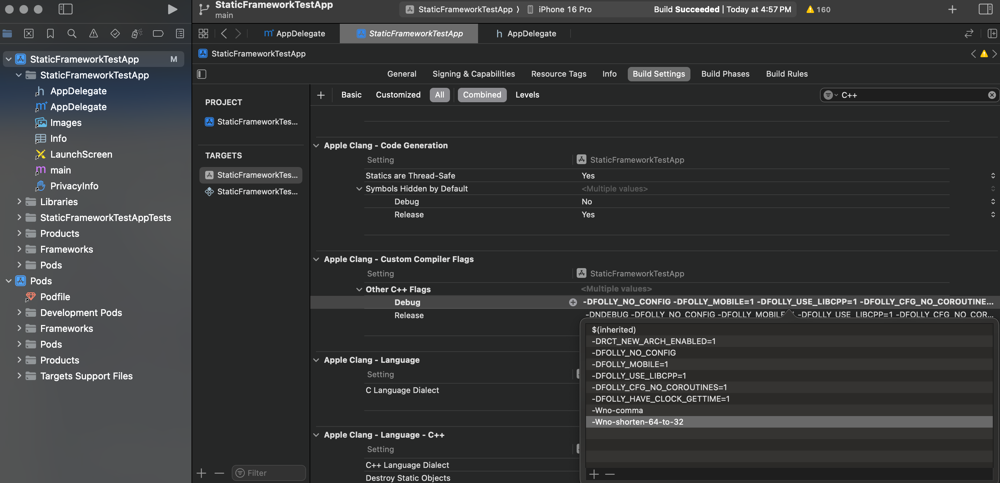

# react-native-static-framework

## [Issue Analysis] Non-Modular Header Inclusion in Framework Module

### Steps to Reproduce the Issue

1. Encounter the following error when importing Swift modules in the `AppDelegate.mm` file:

   

2. Following the guidance in this [documentation](https://github.com/adobe/aepsdk-react-native?tab=readme-ov-file#troubleshooting-and-known-issues), add the C++ compiler flag in Xcode:
 
   

3. Recompile the project and observe the "include of non-modular header inside framework module" error:
 
   

### Solution 1

In your Xcode project:

- Navigate to `Build Settings` => `Apple Clang - Language - Modules`.
- Set `Allow Non-modular includes in Framework Modules` to "Yes" (the default is "No").
- Clean and rebuild the project.

   

### Solution 2

1. If you added the C++ compiler flag `-fcxx-modules` while following the troubleshooting guide, please remove it.



2. Move the Adobe SDK initialization code to a separete Objective-C file.

    - Refer to [AdobeBridge.h](./StaticFrameworkTestApp/ios/StaticFrameworkTestApp/AdobeBridge.h)
    - Refer to [AdobeBridge.m](./StaticFrameworkTestApp/ios/StaticFrameworkTestApp/AdobeBridge.m)

3. In the `AppDelegate.mm` file, import the header file and invoke the Objective-C function to intialize the Adobe SDK.

   - Refer to [AppDelegate.mm](./StaticFrameworkTestApp/ios/StaticFrameworkTestApp/AppDelegate.mm)

```objc
#import "AdobeBridge.h"

- (BOOL)application:(UIApplication *)application didFinishLaunchingWithOptions:(NSDictionary *)launchOptions
{
  
  // ...
  
  [AdobeBridge initializeAdobeSDK];
  
  // ...
  
}
```